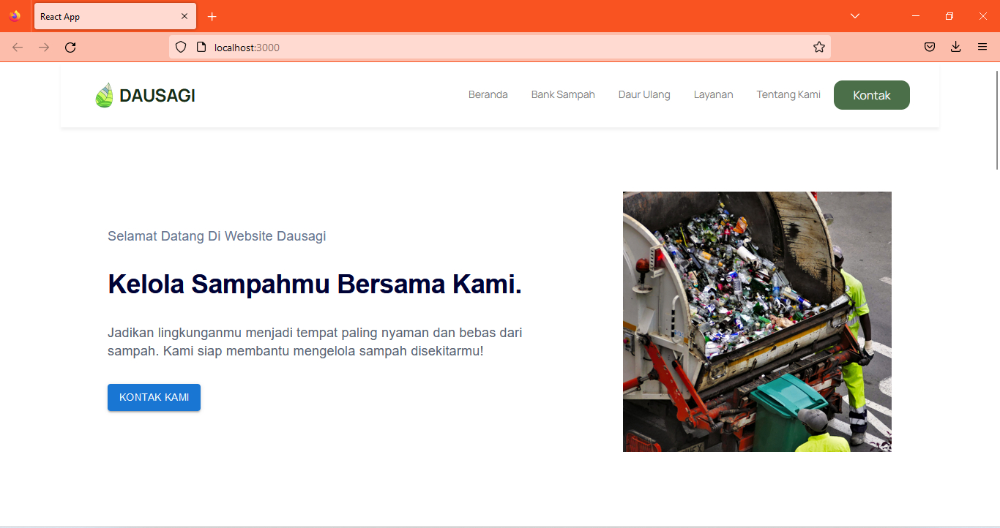

# Dausagi
> Platform Bank Sampah Digital.



<p>Dausagi merupakan website yang dibangun menggunakan framework React.Js yang terfokus menjadi platform bank sampah digital. Disini user bisa mengorder penabungan sampah lalu akan langsung dikonversi oleh menjadi rupiah oleh website kemudian sampah akan dijemput langsung ke lokasi.</p>


## Dibangun Dengan

* HTML 5.2
* CSS 3
* Javascript
* React.Js 18.2.0
* Material UI 5.10.15


## Instalasi & Konfigurasi Proyek Aplikasi Web


### `Memasang semua package`

```
npm install
```

###  `Memulai proyek`

```
npm start
```
Jalankan proyek di mode development.\
 Buka [http://localhost:3000](http://localhost:3000) untuk melihat di browser.

Halaman akan memuat ulang jika dilakukan perubahan.\
Error juga bisa dilihat pada console browser.


### `Menguji coba run`

```
npm test
```

### `Melakukan Build`

```
npm run build
```

### `Mencari Package`

```
npm search <kata-kunci>
```

### Mencopot Package

```
npm uninstall <nama-package>
```

### `Keluar dari proses`

```
npm run eject
```
**Catatan: ini adalah operasi satu arah. Setelah melakukan "eject", maka tidak dapat kembali!**


<!-- LISENSI -->
## Lisensi

Didistribusikan dengan lisensi C22-107. Silahkan cek `License.txt` untuk informasi selengkapnya.


<!-- Kontak -->
## Kontak

Sinatra Kusuma - R009X0088 - sinatrakusuma302@gmail.com <br>
Ervan Muhammad Adrian - R237X0463 - ervanmuhammada454@gmail.com <br>
Enzi Marni - R132Y0225 - enjiimarnii@gmail.com <br>
Muhammad Ichsan Alfarabi - R009X0070 - ihsanredarmy36@gmail.com <br>

Link Proyek: [https://github.com/sinatrakusuma/capstone-project](https://github.com/sinatrakusuma/capstone-project) <br>


